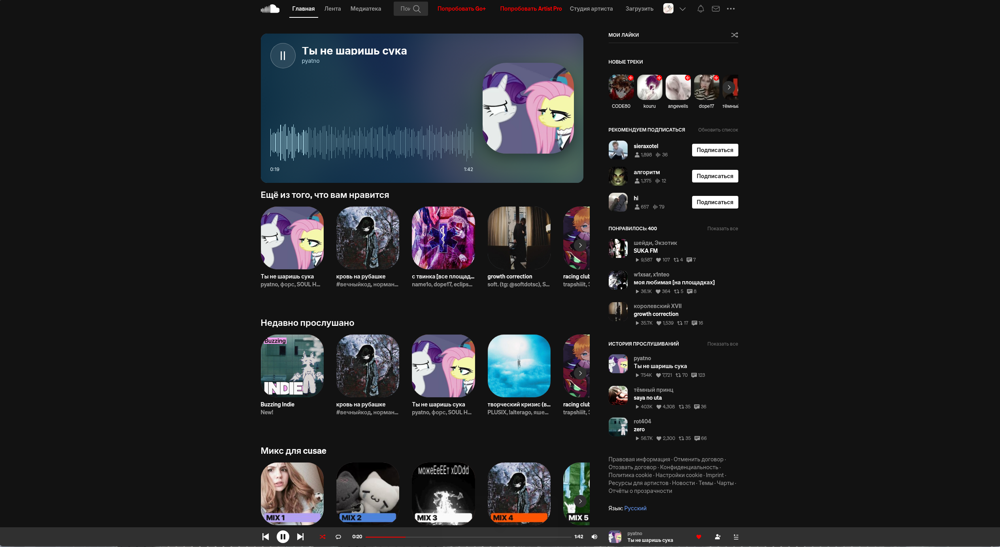

# SoundCloud Desktop

SoundCloud в отдельном окне для рабочего стола. Приложение сохраняет вход в аккаунт и добавляет несколько настроек интерфейса, которых нет на сайте.



## Что есть в приложении

- **cusade Insights.** Личная статистика на главной странице: прослушанные треки, любимые исполнители, итоги за 7 и 30 дней, история и забытые композиции. Карточка находится в правом столбце. Через меню «⋯» её можно скрыть на три дня или перенести: зажмите карточку, отпустите её в нужном месте и потяните за угол для изменения размера. При переносе в другой столбец ширина автоматически подстраивается под него; вручную заданный размер сохраняется при перемещении внутри столбца. Скрытие карточки не останавливает сбор статистики. Карточку статистики можно сохранить как PNG или скопировать для Telegram и Discord. Данные собираются только при воспроизведении через приложение и хранятся локально в `insights.json` профиля приложения.
- **Визуализация воспроизведения.** Текущий трек с обложкой, прогрессом и кнопкой паузы прямо на главной странице. Её фон и карточка Insights получают один цвет от обложки и плавно меняются вместе с треком. При включённых анимациях название, обложка и волна мягко сменяются, а прогресс движется плавно.
- **Мои лайки.** Кнопка в правом столбце запускает понравившиеся треки в случайном порядке. Переход к списку лайков и обратно скрыт.
- **Настройки внешнего вида.** Можно поменять акцентный цвет, стиль значка окна и трея и отдельно настроить скругление аватарок, обложек треков и альбомов. Доступны официальные варианты Cloudmark: чёрный на оранжевом и белый на чёрном. Значок установщика и ярлыка Windows остаётся вариантом, выбранным при сборке. Подсветка при наведении повторяет выбранное скругление.
- **Анимации.** Переключатель cusade добавляет появление карточек и плавные реакции обложек, аватарок, профилей, списков лайков и треков, вкладок, кнопок, меню и элементов плеера на разных страницах SoundCloud. При переходе на другую страницу приложение показывает мягкий затемняющий занавес с акцентной полосой по верхнему краю, а первая страница после запуска открывается этим же приёмом. Кнопки-действия («Подписаться», «Моя статистика», кнопка воспроизведения в визуализации) при наведении не подпрыгивают, а плавно увеличиваются; мелкие иконки и строки списков сохраняют свой прежний размер и меняют подсветку. Выключен по умолчанию. Если система сообщает об уменьшении движения (например, в Windows выключены анимации интерфейса), панель cusade предупредит об этом, но продолжит показывать анимации — включённый переключатель всегда действует. Переключатель «Учитывать системное уменьшение движения» в панели отдаёт системной настройке приоритет и приглушает эффекты.
- **Чище главная.** Промоблоки Artist tools и баннер «События рядом» можно скрыть по отдельности.
- **Русский язык.** Пункт «Русский» добавлен в меню выбора языка SoundCloud. Приложение автоматически переводит подписи интерфейса по мере появления на странице и учитывает исходный язык сайта: английский, итальянский или испанский. Известные подписи получают проверенный перевод сразу, остальные обрабатывает встроенная автономная модель. Названия треков, исполнителей, комментарии и другой пользовательский текст сохраняются. Модели поставляются с приложением; текст не отправляется в службу перевода. Машинный перевод новых надписей может быть неточным.
- **Воспроизведение в фоне.** Закрытие окна сворачивает приложение в системный трей, и музыка продолжает играть. В меню значка выберите «Открыть SoundCloud», чтобы вернуть окно, или «Выход», чтобы полностью закрыть приложение.
- **Скрыть рекламу.** Переключатель cusade блокирует аудиорекламу при запуске следующих треков.
- **Discord RPC.** Показывает трек, исполнителя, обложку и время воспроизведения в настольном Discord. Использует ID приложения cusade по умолчанию; при желании его можно заменить в меню.
- **Автозапуск.** Запуск вместе с Windows или Linux; можно сразу оставить окно свёрнутым в системном трее.
- **Обновления.** Приложение проверяет GitHub Releases при запуске и каждые шесть часов. При новой версии приходит системное уведомление; нажмите на него или откройте обновление через меню значка в трее. В появившейся карточке нажмите «Обновить» для загрузки, затем «Установить и перезапустить». В Windows обновление устанавливается в текущую папку без повторного мастера установки; загрузка использует блоки изменившихся данных, когда они доступны. Windows может запросить права администратора. DEB, RPM и pacman запускают пакетный менеджер напрямую и ждут системного подтверждения прав. AppImage обновляется без системного установщика. В карточке остаётся ссылка на страницу релиза для ручной установки при ошибке.

Настройки сохраняются между запусками. Панель cusade и кнопка «Мои лайки» подстраиваются под светлую и тёмную темы SoundCloud.

Для Discord RPC включите переключатель в cusade; отдельное приложение Discord создавать не нужно. По умолчанию используется Application ID `1555593977367887893`. Если хотите собственное отображаемое имя приложения, создайте его в [Discord Developer Portal](https://discord.com/developers/applications) и укажите **Application ID** в поле cusade. Очистка поля возвращает стандартный ID. Нужен запущенный настольный клиент Discord; выключение переключателя очищает статус.

## Запуск

Готовые установщики находятся в [Releases](https://github.com/sykia/soundcloud-desktop/releases):

- **Arch Linux, Manjaro и совместимые:** скачайте `.pkg.tar.zst` и установите командой `sudo pacman -U ./soundcloud-desktop-*.pkg.tar.zst`.
- **Debian, Ubuntu, Linux Mint и совместимые:** скачайте `.deb` и установите командой `sudo apt install ./soundcloud-desktop_*.deb`.
- **Fedora и совместимые:** скачайте `.rpm` и установите командой `sudo dnf install ./soundcloud-desktop-*.rpm`. В openSUSE используйте `sudo zypper install ./soundcloud-desktop-*.rpm`.
- **Другие дистрибутивы x86_64:** скачайте `.AppImage`, выполните `chmod +x SoundCloud-Desktop-*.AppImage` и запустите файл.
- **Windows x64:** запустите `.exe`. Установщик добавит приложение в меню «Пуск» и создаст значок на рабочем столе.

Проверку можно запустить вручную через меню значка в трее. Установщик Windows пока не подписан цифровым сертификатом. Для системных Linux-пакетов установка обновления использует системный запрос прав: подтвердите действие в появившемся окне. Если запрос прав недоступен или установка не удалась, откройте страницу релиза из карточки обновления и установите пакет вручную. В версиях до 0.5.2 кнопка установки системного Linux-пакета может завершаться ошибкой; для перехода на новую версию установите пакет со страницы релиза через менеджер дистрибутива один раз.

### Из исходников

Нужны Node.js и npm. В каталоге проекта:

```bash
npm ci
npm start
```

Проверка JavaScript:

```bash
npm run check
```

Для локальной сборки установщиков используйте `npm run dist:linux` на Linux или `npm run dist:win` на Windows. Файлы появятся в `dist/`. Для работы приложения нужен интернет и доступ к SoundCloud.

Приложение начинает с Google DNS. Если загрузка SoundCloud завершается ошибкой разрешения имени, оно очищает DNS-кеш и пробует Cloudflare, затем Quad9. Для остальных сетевых ошибок DNS не переключается. Каждая попытка загрузки ограничена 30 секундами; код ошибки показывается на странице повтора. Смена DNS не устраняет блокировку IP-адреса, ошибки TLS или недоступность самого сайта.

## Где находятся настройки

Нажмите правой кнопкой мыши на логотип SoundCloud слева вверху и выберите **cusade**. Там находятся переключатели визуализации, анимаций, учёта системного уменьшения движения, кнопки «Мои лайки», блока Artist tools, баннера «События рядом» и пункт «Скрыть рекламу», а также настройки цвета, стиля значка и скругления.

Язык меняется через ссылку **Language** внизу справа на сайте. После выбора «Русский» панель cusade тоже станет русской. Выбор другого языка возвращает обычный интерфейс SoundCloud.

В меню **Навигация** доступны команды «Назад», «Вперёд», «Обновить» и «На главную». Ссылки за пределы SoundCloud открываются в системном браузере.

Ссылки SoundCloud внутри приложения остаются в нём. Внешнее приложение может открыть трек через `soundcloud-desktop://open?url=<закодированный HTTPS-адрес SoundCloud>`. Linux-пакет регистрирует эту схему; если система не назначила обработчик, выполните `xdg-mime default io.github.sykia.soundcloud-desktop.desktop x-scheme-handler/soundcloud-desktop`. Обычные ссылки `https://soundcloud.com/...` из браузера нельзя автоматически перенаправить в этот клиент по одному домену: для этого Windows требует подтверждение владельца сайта, а Linux не предоставляет стандартной привязки HTTPS-обработчика к отдельному домену. Приложение не заменяет системный браузер.

## Примечания

Это неофициальный клиент, не связанный с SoundCloud. Он отображает сайт SoundCloud, поэтому после изменений на сайте отдельные функции или переводы могут потребовать обновления. Данные входа и настройки хранятся локально в профиле приложения и не входят в репозиторий.

Значок приложения сделан из [Cloudmark медиакита SoundCloud](https://soundcloud.com/company/media-kit). Список изменений по версиям — в [CHANGELOG.md](CHANGELOG.md).
